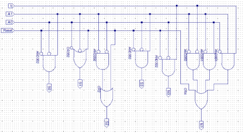

# Xilinx Project – Traffic Signal

## Khuaja Shams and Heng Tan

# Project Specifications

Purpose

The purpose of this project is to emulate a 4 way traffic stop controller with a stop walk on our FPGA board. It was also to go over the controller design process of a HLSM as well as coding it in Verilog. We did this using 4 LEDs to indicate if each of the two streetlights were green or red. We used Xilinx software to write our Verilog code, draw our schematic, simulate it on a test bench, and write an implementation constraint file. We used a Basys 2 Board to implement our Verilog code on a FPGA board.

Design Constraints

- Only use 4 LED lights to represent the lights of the street crossing to indicate which lights are green, red, or when the pedestrian walk is on
- Have a button for the pedestrian crossing
- Use Xilinx Software to create the code in Verilog, simulate a test bench, and create an implementation constraint file
- Use Adept Software to link the Verilog code with a Basys 2 board.
- Use a 25 MHz, 50 MHz, or 100 MHz clock on the Basys 2 board
- Have a debouncer for the system
- Use the RTL design process to create your Controller and Datapath

# System Design, Architecture, and Performance

Controller Design

**FSM**

**Architecture**

**HLSM**

Truth Table

_B = button, Reset = reset button, A1 and A0 = current state, S3-S0 = LED outputs, N1 and N0 = next state_

| **Reset** | **B** | **A1** | **A0** | **S3** | **S2** | **S1** | **S0** | **N1** | **N0** |
| --- | --- | --- | --- | --- | --- | --- | --- | --- | --- |
| 0 | 0 | 0 | 0 | 0 | 1 | 1 | 0 | 1 | 0 |
| 0 | 0 | 0 | 1 | 0 | 0 | 0 | 0 | 1 | 0 |
| 0 | 0 | 1 | 0 | 1 | 0 | 0 | 1 | 0 | 0 |
| 0 | 0 | 1 | 1 | 0 | 0 | 0 | 0 | 0 | 0 |
| 0 | 1 | 0 | 0 | 0 | 1 | 1 | 0 | 0 | 1 |
| 0 | 1 | 0 | 1 | 0 | 0 | 0 | 0 | 1 | 0 |
| 0 | 1 | 1 | 0 | 1 | 0 | 0 | 1 | 1 | 1 |
| 0 | 1 | 1 | 1 | 0 | 0 | 0 | 0 | 0 | 0 |
| 1 | X | X | X | 0 | 1 | 1 | 0 | 1 | 0 |

Controller Schematic

Timing Diagrams

YouTube Video

[https://www.youtube.com/watch?v=4XqjhOnT1lA&feature=emb\_logo](https://www.youtube.com/watch?v=4XqjhOnT1lA&feature=emb_logo)

# Problems and Technical Issues

We didn't run into many problems for this project. The biggest problem we ran into was trying to get the timing of the lights to correctly be three and five seconds. At first, we set the time too fast and all the lights seemed lit up at once. We thought we had accidently set all the lights on, but we realized it was because it was changing between states so quickly. We then kept increasing the timing until we finally got it to be three and five seconds of wait times for the appropriate states. Another problem we ran into early on was only having one state for the pedestrian. This made it a problem when trying to decide if which stoplight state we wanted to change into after the five seconds. We fixed this by having two separate pedestrian states that each went to the correct next streetlight state.

# Conclusion

Our system worked successfully in regard to the specifications provided. Our state outputs, transitions, and wait times all worked correctly. It also successfully got simulated on the testbench as well as being implemented onto the FPGA board. We added a few extra things that weren't required to add to the creativity. One of the things was a countdown timer for both the 3 second stoplight phase and the 5 second pedestrian phase on the digital LED display to let us know how much time was left in a certain state. Additionally, we added a reset button that would reset our system to the first state. This addition helped us debug the timing problem and record the wait time of our system accurately. We also added a button that when pressed would light up all the LEDs in a circular motion. This could help us see if anyone of our LED lights have burned out or are broken. One way we could improve the system would be to have a yellow light as well. We could also add a separate indicator for the pedestrian crossing instead of having all the lights red. We could also integrate the crosswalk to have it cross with the direction of traffic separately instead of having a dedicated time for all pedestrians to cross.
